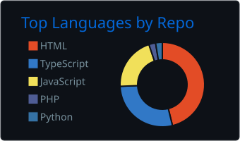
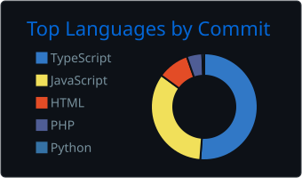
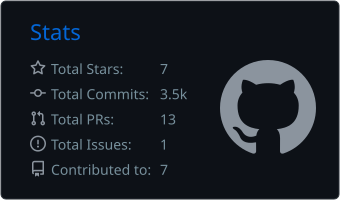
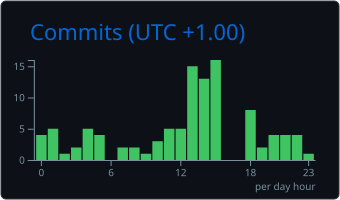

<!-- ═══════════════════════════ HERO ═══════════════════════════ -->

<div align="center">


<a href="https://github.com/eseoghene94">
  
</a>

<p>
  <a href="https://eseoghenethedeveloper.vercel.app"></a>
  <a href="https://linkedin.com/in/eseoghene94"></a>
  <a href="https://x.com/eseoghene94"></a>
  <a href="https://www.buymeacoffee.com/eseoghene94"></a>
  
</p>

</div>

<!-- ═══════════════════════════ ABOUT ═══════════════════════════ -->

<table>
<tr>
<td width="55%" valign="top">

### `$ whoami`

```yaml
name:      Eseoghene
role:      Fullstack Engineer
focus:     [ clean architecture, resilient APIs, CI/CD ]
location:  Lagos, Nigeria 🇳🇬
remote:    open to global collaborations 🌍
exploring: [ AI agents, microservices, observability ]
```

</td>
<td width="45%" valign="top">

### `$ now --status`

* 🔭 Building production-grade fullstack applications
* 🤖 Exploring AI agents and LLM workflows
* ☁️ Going deeper into Kubernetes and serverless
* 📈 Improving monitoring and distributed systems
* 💬 Ask me about Node.js, Django, Docker and AWS

</td>
</tr>
</table>

<!-- ═══════════════════════════ STACK ═══════════════════════════ -->

## ⚡ Tech Stack

<table>
<tr>
<td align="center" width="140"><b>Frontend</b></td>
<td></td>
</tr>

<tr>
<td align="center"><b>Backend</b></td>
<td></td>
</tr>

<tr>
<td align="center"><b>Data</b></td>
<td></td>
</tr>

<tr>
<td align="center"><b>Cloud & DevOps</b></td>
<td></td>
</tr>
</table>

<!-- ═══════════════════════════ PROJECTS ═══════════════════════════ -->

## 🚀 Featured Projects

<table>
<tr>
<td width="50%" valign="top">

### 🛒 [E-Commerce Platform](https://github.com/eseoghene94/e-commerce-platform)

Multi-vendor marketplace with vendor dashboards, product catalogs and order flows.


</td>

<td width="50%" valign="top">

### 💬 [Social Media App](https://github.com/eseoghene94/social-media-app)

Real-time community platform with feeds, interactions and live updates.


</td>
</tr>
</table>

<div align="center">
  
</div>

<!-- ═══════════════════════════ ANALYTICS ═══════════════════════════ -->

## 📊 GitHub Analytics

<div align="center">


<br/>


<br/>






<br/>


### 🏆 Achievements


</div>

<!-- ═══════════════════════════ SNAKE ═══════════════════════════ -->

## 🐍 Contribution Snake

<div align="center">
<picture>
  <source media="(prefers-color-scheme: dark)" srcset="https://raw.githubusercontent.com/eseoghene94/eseoghene94/output/github-snake-dark.svg" />
  <source media="(prefers-color-scheme: light)" srcset="https://raw.githubusercontent.com/eseoghene94/eseoghene94/output/github-snake.svg" />
  
</picture>
</div>

<!-- ═══════════════════════════ FOOTER ═══════════════════════════ -->

<div align="center">

<br/>

> *"Any sufficiently advanced technology is indistinguishable from magic."* — Arthur C. Clarke


</div>
